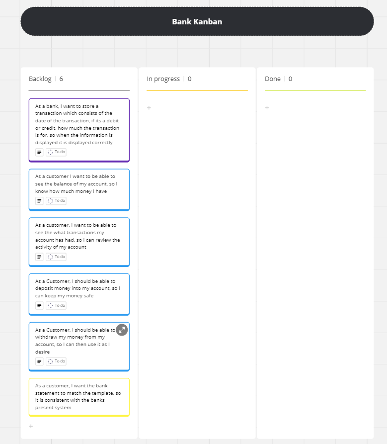
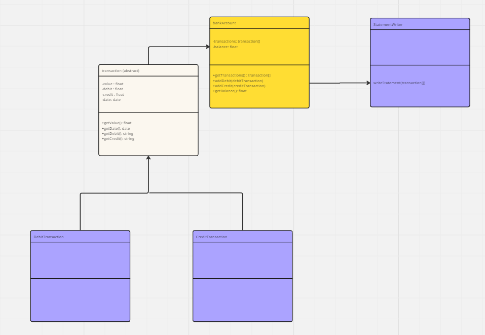
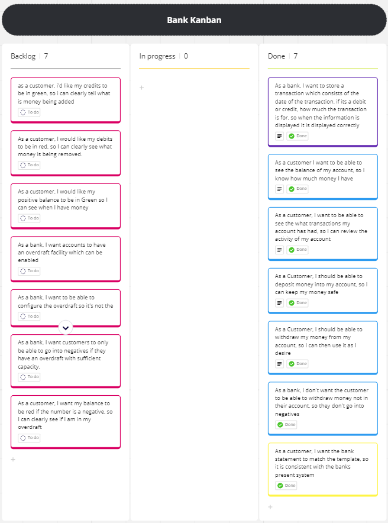

# Domain Models and Test Plan

## Kanban Board

Link: <https://miro.com/app/board/uXjVKPl7MHQ=/?share_link_id=676272517211>

## Transaction Class

### User Story 1

As a bank, I want to store a transaction which consists of the date of the transaction, if its a debit or credit, how much the transaction is for, so when the information is displayed it is displayed correctly

### Domain Model 1

| Objects    | Properties     | Messages    | Output  |
| ---------- | -------------- | ----------- | ------- |
| transaction| - #value   - #debit   - #credit   - #date | - getValue()   - getDate()  - getCredit()   - getDebit() | - @float   - @date   - @float   - @float |

### tests 1

- [x] creditTransaction should instantiate
- [x] getValue should return a positive value for a credit transaction
- [x] getValue should return a different positive value for a credit transaction
- [x] getCredit should return a positive value for a credit transaction
- [x] getCredit should return a different positive value for a credit transaction
- [x] getDebit should return a blank string for a credit transaction
- [x] getDate should return a date for a credit transaction
- [x] getDate should return a different date for a credit transaction
- [x] debitTransaction should instantiate
- [x] getValue should return a negative value for a debit transaction
- [x] getValue should return a different negative value for a debit transaction
- [x] getDebit should return a positive value for a debit transaction
- [x] getDebit should return a different positive value for a debit transaction
- [x] getCredit should return a blank field for a debit transaction
- [x] getDate should return a date for a debit transaction
- [x] getDate should return a different date for a debit transaction

## Account Class

### User Story 2

As a customer I want to be able to see the balance of my account, so I know how much money I have

### Domain Model 2

| Objects    | Properties     | Messages    | Output  |
| ---------- | -------------- | ----------- | ------- |
| account | - #balance @float | - getBalance() | - @float |

### tests 2

- [x] getBalance should return the balance of the account

### User Story 3

As a customer, I want to be able to see the what transactions my account has had, so I can review the activity of my account

### Domain Model 3

| Objects    | Properties     | Messages    | Output  |
| ---------- | -------------- | ----------- | ------- |
| account | - #transactions {@Transaction[], @float} | - getTransactions() | - {@transaction,@float}[] |

### Tests 3

- [x] getTransactions returns an empty list before any transactions have been added
- [x] getTransactions returns a list which consists of a transaction and a float.
  
### User Story 4

As a Customer, I should be able to deposit money into my account, so I can keep my money safe

### Domain Model 4

| Objects    | Properties     | Messages    | Output  |
| ---------- | -------------- | ----------- | ------- |
| account | - #transactions {@Transaction[], @float} | - addtransaction(@transaction) | - void |

### Tests 4

- [x] getBalance() should return an increased balance when a credit transaction is added
- [x] getTransactions() should return an array one larger than before the transaction was added

### User Story 5
As a Customer, I should be able to withdraw my money from my account, so I can then use it as I desire

### Domain Model 5
| Objects    | Properties     | Messages    | Output  |
| ---------- | -------------- | ----------- | ------- |
| account | - #transactions {@Transaction[], @float} | - addDebit(@transaction) | - void |

### Tests 5

- [x] getBalance should return a decreased balance when a debit transaction is added
- [x] getTransactions should return an array one larger than before the transaction was added
  
### User Story 6
As a bank, I don't want the customer to be able to withdraw money not in their account, so they don't go into negatives

### Domain model 6

| Objects    | Properties     | Messages    | Output  |
| ---------- | -------------- | ----------- | ------- |
| account | - #transactions {@Transaction[], @float} | - addTransaction(@transaction) | - void |

### Tests 6

- [x] a debit transaction bigger than the balance should return a 'insufficient balance' message
- [x] an accepted transaction should return 'transaction complete' message

### User Story 7

As a customer, I want the bank statement to match the template, so it is consistent with the banks present system

### Domain model 7

| Objects    | Properties     | Messages    | Output  |
| ---------- | -------------- | ----------- | ------- |
| StatementWriter | -  | - printStatement({@Transaction[], @float}[]) | - void |

### Tests 7

- [x] lineCrafter produces correctly displayed transaction lines
- [x] headerString produces the correct header for the report
- [x] printTransaction takes the list of transactions and outputs them in the same format as required

## UML class diagram

## Additional Features

### User Story 8

as a customer, i'd like my credits to be in green, so i can clearly tell what is money being added

### Domain model 8

| Objects    | Properties     | Messages    | Output  |
| ---------- | -------------- | ----------- | ------- |
| StatementWriter | -  | - printStatement({@Transaction[], @float}[]) | - void |

### Tests 8

-[ ] credit column comes out green

### User Story 9

As a customer, I would like my debits to be in red, so I can clearly see what money is being removed.

### Domain model 9

| Objects    | Properties     | Messages    | Output  |
| ---------- | -------------- | ----------- | ------- |
| StatementWriter | -  | - printStatement({@Transaction[], @float}[]) | - void |

### Tests 9

-[ ] debit column comes out red

### User Story 10

As a customer, I would like my positive balance to be in Green so I can see when I have money

### Domain model 10

| Objects    | Properties     | Messages    | Output  |
| ---------- | -------------- | ----------- | ------- |
| StatementWriter | -  | - printStatement({@Transaction[], @float}[]) | - void |

### Tests 10

-[ ] balance column comes out green if it is positive in value

### User Story 11

As a bank, I want accounts to have an overdraft facility which can be enabled

### Domain model 11

| Objects    | Properties     | Messages    | Output  |
| ---------- | -------------- | ----------- | ------- |
| account | - #overdraft @boolean | - getOverdraft()  -setOverdraft(@boolean)  | - @boolean |

### Tests 11

- [ ] getOverdraft returns false on a new account
- [ ] getOverdraft returns positive once overdraft has been activated
- [ ] getOverdraft returns false, after it has been activated and then deactivated

### User Story 12

As a bank, I want to be able to configure the overdraft so it's not the same amount on all accounts

### Domain model 12

| Objects    | Properties     | Messages    | Output  |
| ---------- | -------------- | ----------- | ------- |
| account | - #overdraftAmount @boolean | - getOverdraftAmount()  - setOverdraftAmount(@float)  | - @float   - @string |

### Tests 12

- [ ] getOverdraftAmount returns 0 on a new account
- [ ] getOverdraftAmount returns 500 after it has been set to 500
  
### User Story 13

As a bank, I want customers to only be able to go into negatives if they have an overdraft with sufficient capacity.

### Domain model 13

| Objects    | Properties     | Messages    | Output  |
| ---------- | -------------- | ----------- | ------- |
| account | - #balance @float | - addTransaction() | - @string |

### Tests 13

- [ ] addTransaction returns a error message if debit greater than the available balance
- [ ] addTransaction accepts an debitTransaction if the overdraft is true and the balance + the overdraft amount is greater than the debit.
- [ ] verify the normal boundary test
- [ ] verify the abnormal boundary test

### User Story 14

As a customer, I want my balance to be red if the number is a negative, so I can clearly see if I am in my overdraft

### Domain model 14

| Objects    | Properties     | Messages    | Output  |
| ---------- | -------------- | ----------- | ------- |
| StatementWriter | -  | - printStatement({@Transaction[], @float}[]) | - void |

### Tests 14

-[ ] balance column comes out red if it is negative in value
